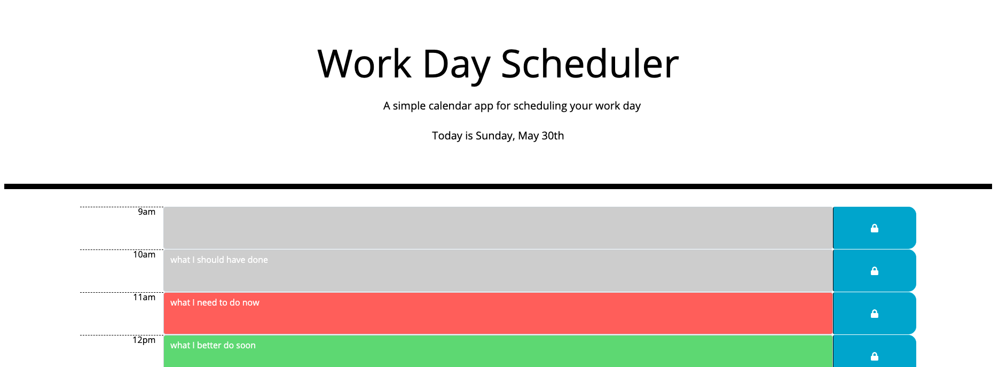

# you better work

## a simple calender app for scheduling your work day

[Live Demo](https://sissyhanks.github.io/you-better-work/)

This app is intended to be used to keep track of one's work day schedule. The current date is displayed at the top of the page and the used can quickly assess where they are in their day by the hourly rows that change color to display hours that have past, the current hour, and teh hours remaining in the work day. Users can customize their calender by making and saving entries of tasks that need to be done and events taking place during each hour block. Saved entries will persist and be displayed anytime the user returns to the page.

With this project I learned that my need for self-expression can be met through the development and execution of a detailed plan for solving the problem at hand. I also kept in mind that I may have ideas to make a project better that are not a part of the project's design. To sate my desire to do more I focused on leaving my code in a state that could easily be altered or added on to when and if further development is pursued.
